# SwiftExample
学习使用swift, 对iOS开发过程中遇到的常用功能做了一些总结, 项目中有过去使用OC开发的文件和第三方库, 直接拿过来混编的, 没有完全使用swift替代, 会持续更新, 希望能和大家在技术上多探讨

## 目前加入的
*  navigationBar渐变背景图.
*  聊天界面.
*  gauss模糊.
*  Share.
*  Map.
*  二维码.
*  视频播放.
*  block.
*  天气.
*  清除缓存.
*  日期选择.
*  我的银行卡.
*  本地相册选取.
*  轮播图.
*  热更新.
*  弹幕.
*  日历.
*  商城.
*  请输入密码.
*  圆形菜单.
*  球形标签.
*  推荐影片.
*  渐隐文字.
*  打印文字.
*  拼图.
*  2048.
*  浏览卡片.
*  抽卡效果.
*  抖动菜单.
*  渐变色.
*  折卡效果.
*  卡牌拖动.
*  摇一摇.
*  ape展开.
*  余额跳动.
*  水平滚动布局.
*  发散菜单.
*  漂浮的雪花.
*  水波.
*  闹钟设置.
*  音乐播放.
*  手势解锁.

## 部分截图
*  Home.

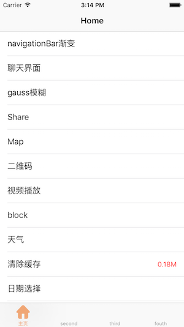

*  Second.

 

*  Third.

 

*  Fouth.

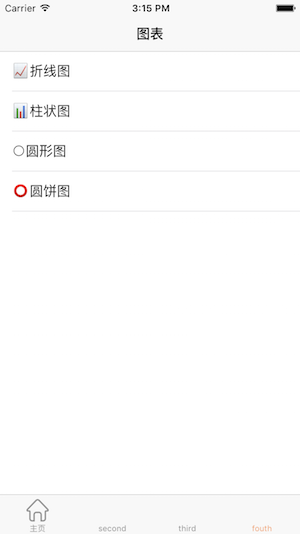 

*  navigationBar渐变背景图.

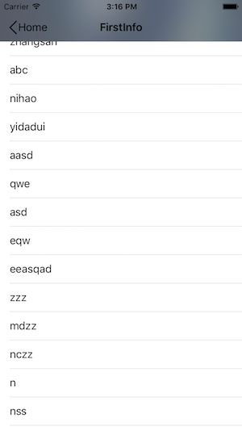  

*  聊天界面.

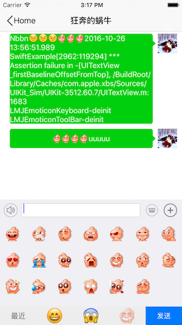

*  gauss模糊.

*  天气.

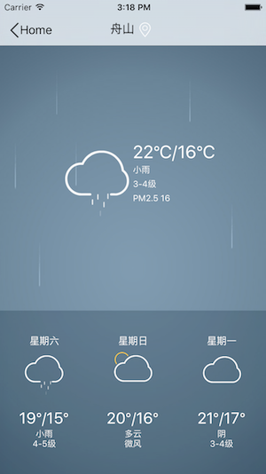

*  我的银行卡.

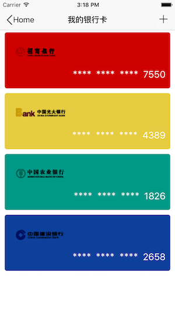

*  本地相册选取.

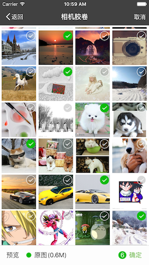

*  热更新.

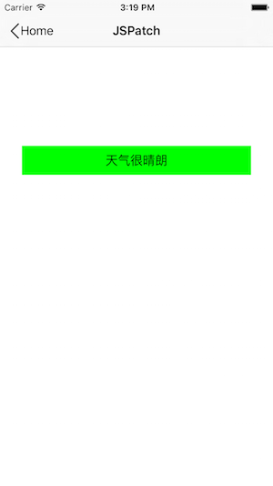

*  日历.

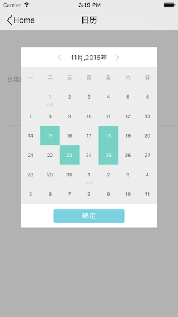

*  商城首页

*  商城首页

*  商城首页

*  商城首页

*  请输入密码.

*  渐变色.

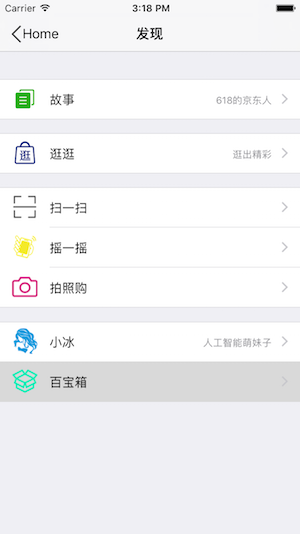

*  余额跳动.

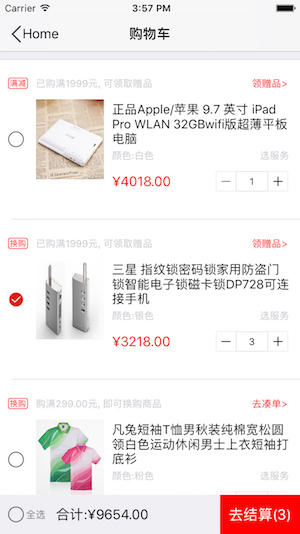

*  漂浮的雪花.

*  水波.

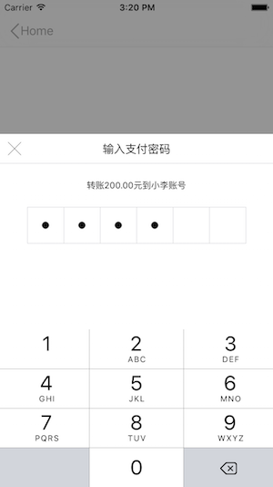

*  水波.

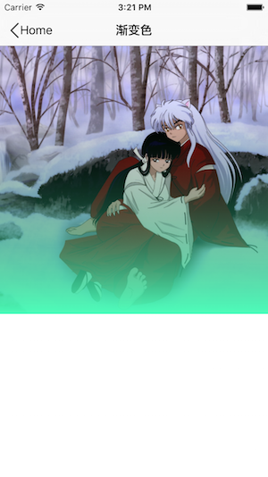

*  水波.

*  水波.

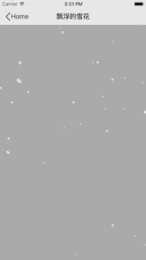

*  水波.

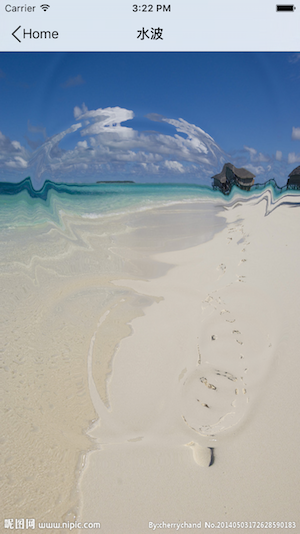

*  水波.

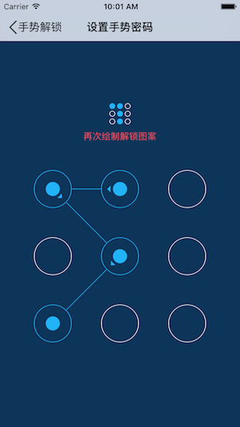

